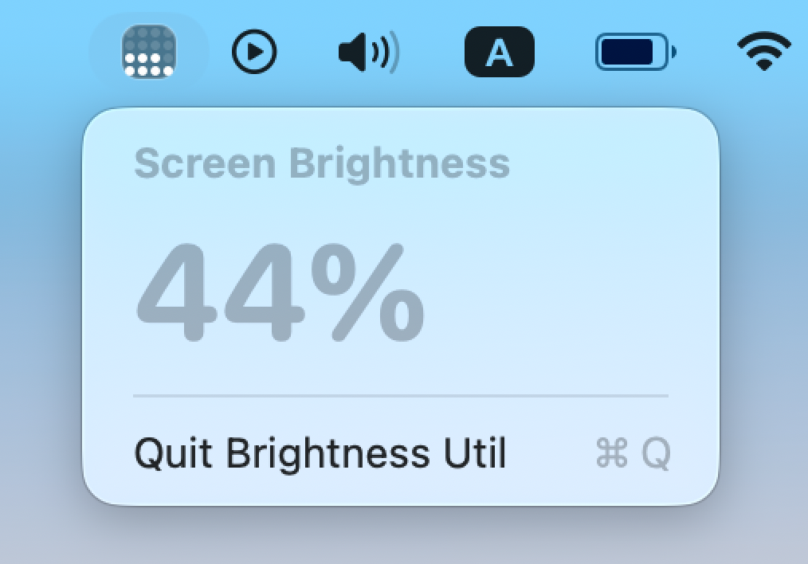

# Brightness Util

Simple menu bar utility that displays the current main-display brightness for macOS 26. The aim is to bring back the 16-cell brightness bar in the macOS 26 menu bar.



The project uses private DisplayServices/CoreDisplay SPI calls (mirroring the `nriley/brightness` fallback chain), so it is only meant for personal, locally signed use.


## Features

- Menu bar extra that mimics the classic 16-cell brightness HUD with crisp dot rendering.
- Popover view showing both the dot grid and an exact percentage for the current brightness.
- Polling monitor that keeps the display in sync via DisplayServices/CoreDisplay/IOKit fallbacks.
- Runs as an accessory app so no Dock icon appears while the utility is active.
- SwiftUI-based implementation with reusable components for the tile and menu icon.

## Building from Terminal

You can build the app without opening Xcode using `xcodebuild`. From the repository root run:

```bash
xcodebuild -project brightness-util.xcodeproj \
           -scheme brightness-util \
           -configuration Release \
           -derivedDataPath build \
           CODE_SIGNING_ALLOWED=NO \
           clean build
```

This places the release `.app` bundle at `build/Build/Products/Release/brightness-util.app`.

To extract just the executable (unsigned) for local use:

```bash
cp build/Build/Products/Release/brightness-util.app/Contents/MacOS/brightness-util \
   build/brightness-util-exec
```

If macOS flags the executable as “damaged,” clear the quarantine bit:

```bash
xattr -cr build/brightness-util-exec
```

## Launching

- To run immediately, execute `open build/Build/Products/Release/brightness-util.app`.
- For direct CLI execution, run `build/Build/Products/Release/brightness-util.app/Contents/MacOS/brightness-util`.
- Move the `.app` into `/Applications` (or anywhere else) to keep it handy between builds.

## Optional Signing & Distribution

- If you want macOS Gatekeeper to trust the binary, rerun the build without the `CODE_SIGNING_ALLOWED=NO` override after selecting a signing identity in Xcode.
- To share the app, zip the `.app` bundle or package it into a `.dmg` (e.g. with `create-dmg` or Disk Utility) before distributing.

## Development Notes

- The SwiftUI preview for `ContentView` sits behind `#if DEBUG` so release builds skip the preview helper and avoid instantiating `BrightnessMonitor` outside Xcode previews.
